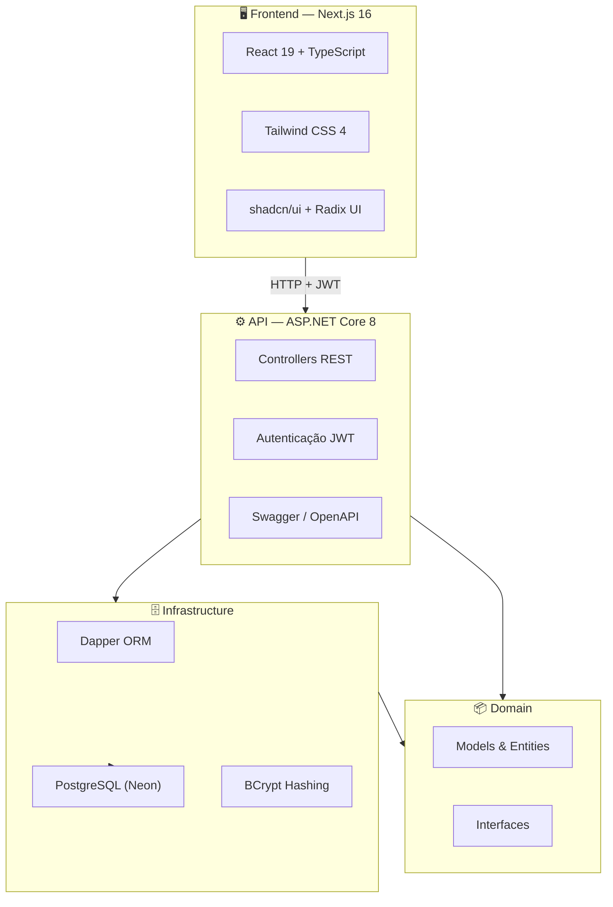

<div align="center">

```
 ██████╗ ██╗  ██╗    ██╗   ██╗███████╗███████╗████████╗
██╔════╝ ██║  ██║    ██║   ██║██╔════╝██╔════╝╚══██╔══╝
███████╗ ███████║    ██║   ██║█████╗  ███████╗   ██║
╚════██║ ╚════██║    ╚██╗ ██╔╝██╔══╝  ╚════██║   ██║
███████║      ██║     ╚████╔╝ ███████╗███████║   ██║
╚══════╝      ╚═╝      ╚═══╝  ╚══════╝╚══════╝   ╚═╝
██████╗ ███████╗███████╗██████╗ ████████╗ ██████╗ ██████╗ ███████╗███████╗██████╗
██╔══██╗██╔════╝██╔════╝██╔══██╗╚══██╔══╝██╔═══██╗██╔══██╗██╔════╝██╔════╝██╔══██╗
██████╔╝█████╗  █████╗  ██████╔╝   ██║   ██║   ██║██████╔╝█████╗  █████╗  ██████╔╝
██╔═══╝ ██╔══╝  ██╔══╝  ██╔═══╝    ██║   ██║   ██║██╔═══╝ ██╔══╝  ██╔══╝  ██╔══██╗
██║     ███████╗███████╗██║        ██║   ╚██████╔╝██║     ███████╗███████╗██║  ██║
╚═╝     ╚══════╝╚══════╝╚═╝        ╚═╝    ╚═════╝ ╚═╝     ╚══════╝╚══════╝╚═╝  ╚═╝
```


<br/>

**Plataforma comunitária de preparação para vestibular com aprendizado peer-to-peer**

*Inspirada na filosofia da École 42 — aprender ensinando, avaliar sendo avaliado.*

<br/>

[]()
[]()
[]()

</div>

---

## Sobre o Projeto

**54 VestPeerToPeer** é uma plataforma web para estudantes se prepararem para vestibulares de forma colaborativa. O diferencial está no sistema **Peer-to-Peer Learning (P2P)**, inspirado diretamente no modelo de correções entre pares da [École 42](https://42.fr) — onde alunos avaliam o trabalho uns dos outros, ganham pontos por contribuir e só podem ser avaliados quando acumulam créditos suficientes.

> *"The best way to learn is to teach."* — filosofia central do projeto.

A plataforma combina conteúdo de estudo (disciplinas, aulas, exercícios, simulados), gamificação e um ecossistema de avaliações entre pares para criar uma comunidade ativa de vestibulandos.

---

## Funcionalidades

| Módulo | Descrição | Status |
|--------|-----------|--------|
| **Dashboard** | Visão geral com pontos, nível, próximas aulas e status P2P | ✅ Ativo |
| **Peer Learning** | Avaliação entre pares, agendamento e sistema de pontos | ✅ Ativo |
| **Autenticação** | Login, registro e sessão JWT | ✅ Ativo |
| **Usuários / Profile** | Perfil do estudante e gestão de conta | ✅ Ativo |
| **Disciplinas** | Matérias do vestibular e avaliações | 🔄 Em progresso |
| **Aulas** | Conteúdo em vídeo e material de apoio | 🔄 Em progresso |
| **Exercícios** | Banco de questões por matéria | 🔄 Em progresso |
| **Simulados** | Provas simuladas cronometradas | 🔄 Em progresso |
| **Gamificação** | Pontos, níveis, badges e ranking | 🔄 Em progresso |
| **Chat** | Comunicação entre estudantes | 🔄 Em progresso |

---

## Sistema Peer-to-Peer

O coração do projeto. Modelado na cultura de **peer evaluation** da 42:

```
┌─────────────────────────────────────────────────────────┐
│                  REGRAS DE PONTUAÇÃO P2P                │
├─────────────────────────────────────────────────────────┤
│                                                         │
│   +3 pts   →  Avaliar um colega                        │
│   -3 pts   →  Agendar uma avaliação para si           │
│   ≥ 3 pts  →  Mínimo necessário para ser avaliado      │
│                                                         │
└─────────────────────────────────────────────────────────┘
```

**Fluxo de uma avaliação:**

1. O estudante acumula pontos avaliando colegas (+3 por avaliação)
2. Com ≥ 3 pontos, pode agendar uma avaliação para ser corrigido (-3 pontos)
3. Um par avalia o exercício, atribui notas de exercício e comportamento
4. O sistema registra a avaliação e atualiza o ranking de gamificação

---

## Arquitetura

O projeto segue **Clean Architecture** com separação clara de responsabilidades:



### Camadas do Backend

```
VestibularPeerToPeer/
├── VestibularPeerToPeer.Domain/          # Entidades, interfaces e contratos
├── VestibularPeerToPeer.Application/     # Casos de uso (em expansão)
├── VestibularPeerToPeer.Infrastructure/  # Dapper, repositórios, PostgreSQL
└── VestibularPeerToPeer.API/             # Controllers, serviços, SPA proxy
    └── ClientApp/                        # Frontend Next.js
```

---

## Stack Tecnológica

### Backend

| Tecnologia | Versão | Uso |
|------------|--------|-----|
| ASP.NET Core | 8.0 | API REST |
| Dapper | 2.1 | Micro-ORM / queries SQL |
| PostgreSQL | — | Banco de dados (Neon cloud) |
| Npgsql | 10.0 | Driver PostgreSQL |
| JWT Bearer | 8.0 | Autenticação stateless |
| BCrypt.Net | 4.1 | Hash de senhas |
| Swagger | 6.6 | Documentação da API |

### Frontend

| Tecnologia | Versão | Uso |
|------------|--------|-----|
| Next.js | 16.2 | Framework React com App Router |
| React | 19.2 | UI declarativa |
| TypeScript | 5.7 | Tipagem estática |
| Tailwind CSS | 4.2 | Estilização utility-first |
| Radix UI | — | Componentes acessíveis |
| shadcn/ui | — | Design system |
| Lucide React | — | Ícones |
| React Hook Form + Zod | — | Formulários e validação |
| Recharts | 2.15 | Gráficos e visualizações |

---

## Estrutura do Frontend

```
ClientApp/
├── app/
│   ├── login/                  # Página de login
│   ├── register/               # Cadastro de usuário
│   └── (authenticated)/        # Rotas protegidas
│       ├── dashboard/          # Painel principal
│       ├── peer-learning/      # Avaliações P2P
│       ├── disciplinas/        # Matérias
│       ├── aulas/              # Conteúdo em vídeo
│       ├── exercicios/         # Questões
│       ├── simulados/          # Provas simuladas
│       ├── gamificacao/        # Ranking e conquistas
│       ├── chat/               # Mensagens
│       └── usuarios/           # Perfil do estudante
├── components/
│   ├── auth/                   # Login e registro
│   ├── dashboard/              # Cards e stats
│   ├── peer-learning/          # Avaliações e modal
│   ├── gamification/           # Níveis, badges, ranking
│   ├── layout/                 # Sidebar e AppLayout
│   └── ui/                     # shadcn/ui components
├── contexts/                   # Auth e Gamification
├── services/                   # Chamadas à API
└── types/                      # Tipos TypeScript
```

---

## API Endpoints

| Método | Rota | Auth | Descrição |
|--------|------|------|-----------|
| `POST` | `/api/usuarios/login` | — | Autenticação e emissão de JWT |
| `POST` | `/api/usuarios/cadastrar` | — | Cadastro de novo usuário |
| `GET` | `/api/disciplina/get-avaliacoes` | JWT | Lista todas as avaliações |
| `GET` | `/api/disciplina/get-avaliacao-usuario` | JWT | Avaliações do usuário logado |
| `GET` | `/api/disciplina/get-avaliacao-usuario-id` | JWT | Avaliações por ID do avaliador |

> Documentação interativa disponível em `/swagger` quando a API estiver rodando.

---

## Como Executar

### Pré-requisitos

- [.NET 8 SDK](https://dotnet.microsoft.com/download/dotnet/8.0)
- [Node.js 22+](https://nodejs.org/)
- [PostgreSQL](https://www.postgresql.org/) ou conta no [Neon](https://neon.tech/)

### 1. Clonar o repositório

```bash
git clone https://github.com/seu-usuario/VestibularPeerToPeer.git
cd VestibularPeerToPeer
```

### 2. Configurar o backend

Edite `VestibularPeerToPeer.API/appsettings.json` (ou use User Secrets):

```json
{
  "ConnectionStrings": {
    "DefaultConnection": "Host=SEU_HOST;Database=SEU_DB;Username=SEU_USER;Password=SUA_SENHA;SSL Mode=Require;"
  },
  "Jwt": {
    "Secret": "sua-chave-secreta-com-pelo-menos-32-caracteres",
    "Issuer": "VestibularPeerToPeer.API",
    "Audience": "VestibularPeerToPeer.ClientApp",
    "ExpiresInHours": 2
  }
}
```

> ⚠️ **Nunca commite credenciais reais.** Use `dotnet user-secrets` ou variáveis de ambiente em produção.

### 3. Instalar dependências do frontend

```bash
cd VestibularPeerToPeer.API/ClientApp
npm install
```

### 4. Executar o projeto

**Opção A — Visual Studio / Rider (recomendado)**

Abra `VestibularPeerToPeer.sln` e execute o projeto `VestibularPeerToPeer.API`. O SPA Proxy inicia o Next.js automaticamente.

**Opção B — Terminal (dois processos)**

```bash
# Terminal 1 — API
cd VestibularPeerToPeer.API
dotnet run

# Terminal 2 — Frontend
cd VestibularPeerToPeer.API/ClientApp
npm run dev
```

### 5. Acessar

| Serviço | URL |
|---------|-----|
| Frontend | [http://localhost:3000](http://localhost:3000) |
| API | [https://localhost:58322](https://localhost:58322) |
| Swagger | [https://localhost:58322/swagger](https://localhost:58322/swagger) |

---

## Design System — Tema 42 Dark

A interface segue a estética **dark terminal** da École 42:

| Token | Valor | Uso |
|-------|-------|-----|
| Background | `oklch(0.145 0 0)` | Fundo principal escuro |
| Primary | Teal `#00BABC` | Acentos, botões, links |
| Foreground | `oklch(0.985 0 0)` | Texto principal |
| Sidebar | `oklch(0.205 0 0)` | Navegação lateral |
| Font Mono | Geist Mono | Headers e labels estilo terminal |
| Font Sans | Geist | Corpo de texto |

O tema dark é aplicado por padrão via `next-themes` e variáveis CSS em `globals.css`.

---

## Roadmap

<details>
<summary><b>Fase 1 — Fundação</b> ✅</summary>

- [x] Arquitetura Clean Architecture (.NET 8)
- [x] Autenticação JWT + BCrypt
- [x] Frontend Next.js com App Router
- [x] Dashboard e layout com sidebar
- [x] Sistema de pontos P2P (frontend)
- [x] Integração API ↔ PostgreSQL via Dapper

</details>

<details>
<summary><b>Fase 2 — Peer Learning completo</b> 🔄</summary>

- [x] Tela de Peer Learning com regras de pontuação
- [x] Modal de agendamento de avaliações
- [x] Endpoints de avaliações no backend
- [ ] Fluxo completo de pareamento avaliador ↔ avaliado
- [ ] Persistência de pontos P2P no banco
- [ ] Notificações de avaliações pendentes

</details>

<details>
<summary><b>Fase 3 — Conteúdo e Gamificação</b> 📋</summary>

- [ ] CRUD de disciplinas e exercícios
- [ ] Módulo de aulas com vídeos
- [ ] Simulados cronometrados
- [ ] Ranking global e badges
- [ ] Chat em tempo real entre estudantes

</details>

<details>
<summary><b>Fase 4 — Produção</b> 📋</summary>

- [ ] Deploy (Vercel + Railway/Render)
- [ ] CI/CD com GitHub Actions
- [ ] Testes automatizados (xUnit + Playwright)
- [ ] Documentação OpenAPI completa

</details>

---

## Como Estou Construindo

Este projeto é desenvolvido de forma incremental, seguindo práticas da comunidade 42:

```
1. Definir o domínio     →  Models e interfaces no Domain
2. Implementar infra     →  Repositórios Dapper + PostgreSQL
3. Expor via API         →  Controllers REST com JWT
4. Construir a UI        →  Componentes React modulares
5. Integrar e iterar     →  Conectar frontend ↔ backend
6. Gamificar             →  Pontos, níveis e peer evaluation
```

**Princípios adotados:**

- **Peer learning first** — a avaliação entre pares é o núcleo, não um extra
- **Clean Architecture** — dependências apontam para dentro (Domain no centro)
- **Component-driven UI** — cada feature é um módulo isolado no frontend
- **Dark by default** — experiência imersiva inspirada na 42
- **API-first** — backend desacoplado, consumido pelo SPA via fetch + JWT

---

<div align="center">

<br/>

```
/* 42 */  while (alive) { learn(); teach(); evaluate(); }
```

<br/>

**54 VestPeerToPeer** — *Aprender juntos. Avaliar juntos. Crescer juntos.*

<br/>

Desenvolvido com ☕ e peer pressure saudável.

<br/>

[]()
[]()

</div>
